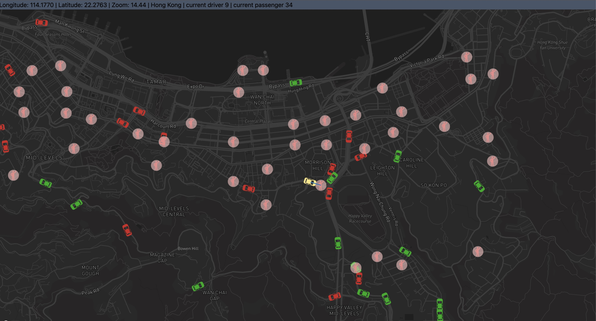

# HKU Smart Mobility Lab: Driver-Order Matching Visualization

This repository contains a versatile and interactive visualization tool developed by the Smart Mobility Lab at The University of Hong Kong (HKU), under the direction of Dr. KE Jingtao. The primary aim of this project is to provide a customizable visualization of a driver-order matching broadcasting algorithm. It is designed to emulate and illustrate scenarios akin to ride-hailing services like Uber.



## Features

The visualization tool showcases a detailed simulation of around 200 drivers and approximately 1000 order requests within the Hong Kong Island area. Users are empowered to configure their own data sets, allowing for extensive adaptability and customization based on individual requirements.

## Application

This project has significant implications for the design of smart mobility and ride-hailing services. By visualizing and analyzing the dynamics of driver-order matching algorithms, we can identify potential inefficiencies, devise strategies for improvement, and ultimately enhance the user experience for both drivers and passengers.

We welcome contributions and feedback to further improve this tool and broaden its potential applications.

## Citation
If you use any part of this repo, you are highly encouraged to cite our paper:

Chen, T., Shen, Z., Feng, S., Yang, L., & Ke, J. (2025). Dynamic matching radius decision model for on-demand ride services: A deep multi-task learning approach. Transportation Research Part E: Logistics and Transportation Review, 193, 103822.

## Getting Started with this Project

### 1.Install all the dependencies

At the root path of the project,

`npm install`
,

`npm start`

- Note that the default port is set as 3001, which can be altered in .env
- Should there be any problems, delete `package-lock.json`, and re-install


### 2.Replace Mapbox token

You should include your Mapbox token in `.env` file

To obtain a token, you can find more information in the [Mapbox official documentation](https://docs.mapbox.com/help/getting-started/access-tokens/). The service is free for use on a personal scale.


### 3.Add your own data

All the data are stored under `src/data/`.
please name the driver and actions data as driver_route.js and actions_list.js.

Note that driver_route.js should follow the format below

```js
export const drivers = [
  {
    id: 160,
    route: [
      [114.1802652, 22.2632329],
      [114.1802652, 22.2632329],
      ...
      ]
  },{
    id: 200,
    route: []
  }
  ...
]
```

While actions_list.js should be

```js
export const actions = {
  0: [],
  5: [
    {
      actionType: "passengerAppearAction",
      data: [
        {
          passengerid: 34,
          passengerCoordinates: [114.1721163, 22.2819746],
          range: 0.1,
        },
        {
          passengerid: 25,
          passengerCoordinates: [114.1553063, 22.2499421],
          range: 0.1,
        },
        ...
      ],
    },
  ],
  10: [],
  15: [],
  20: [
    {
      actionType: "cancelAction",
      data: [
        {
          passengerid: 111,
        },
      ],
    },
  ],
  ...
}
```

### Action format

```js
const passengerAppearAction = {
  passengerid: 1,
  passengerCoordinates: [114.1694, 22.3193],
  range: 300,
};

const rangeUpdateAction = {
  passengerid: 1,
  passengerCoordinates: [114.1694, 22.3193],
  newRange: 300,
};

const orderReceivedAction = {
  passengerid: 1,
  driverid: 17,
  pickUpTime: 30,
};

const pickUpAction = {
  passengerid: 1,
  driverid: 17,
};

const dropOffAction = {
  driverid: 17,
};

const cancelAction = {
  passengerid: 1,
};
```

### About the configuration params

`carMovingStepsPerTimeInterval`: This parameter defines the number of interpolation between two steps.

`timeInterval`: This parameter defines the duration of each time interval in the simulation, measured in seconds. The default value is 5,

`startingLongitude`: This parameter sets the starting longitude for the map visualization. The default value is 114.1686, which corresponds to a location in Hong Kong Island. You can change this to the longitude of any location you want to focus your simulation on.

`startingLatitude`: Similar to startingLongitude, this parameter sets the starting latitude for the map visualization. The default value is 22.28, which also corresponds to a location in Hong Kong Island. Modify this to change the latitude of your simulation's focus area.

`zoomingLevel`: This parameter controls the initial zoom level of the map in the visualization. The default value is 15, which represents a fairly close view (street level) of the map. Increase this value to zoom in further, or decrease it to zoom out and see a larger area.
